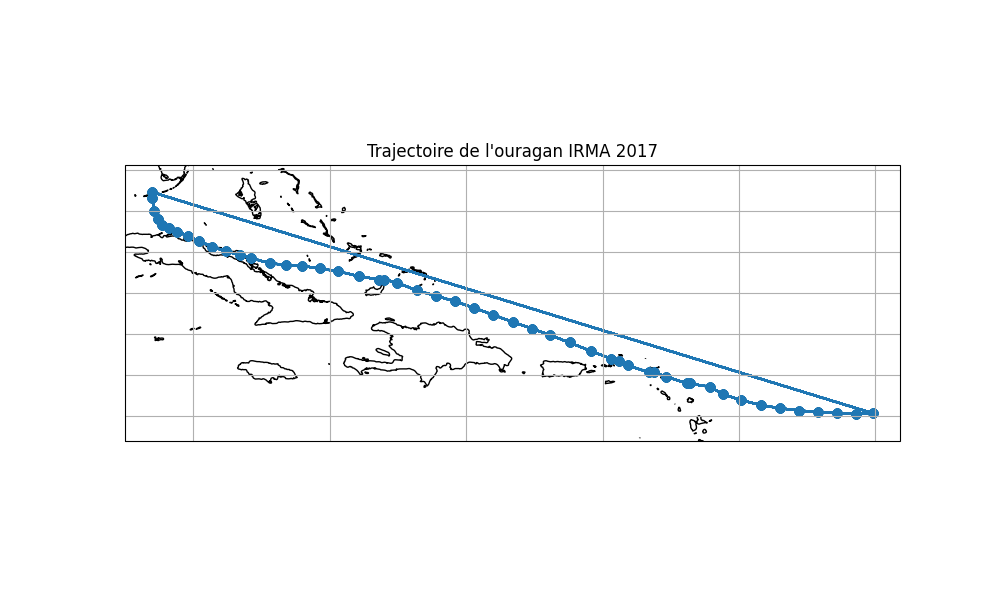

# Étude des trajectoire des tempêtes et ouragans dans la caraïbes

## Nettoyage des données
Nous avons tout d'abord retirer tout les évènement n'étant pas nommées
résultat se trouve dans le fichier Hurricanes.csv

Nous avons rassembler les données des ourgans de même noms dans un fichier csv

Puis nous avons récupérer les ouragans et tempêtes tropicales qui sont passé par 
la caraïbes, résultat dans le fichier hurricanesPastInCaribbean.csv

## graphique des trajectoires
Nous avons ensuite créer un graphique des trajectoires 
des ouragans et tempêtes tropicales qui sont passé par la caraïbes
dans le dossier Trajectoire nous retrouverons classé les graphiques par année

